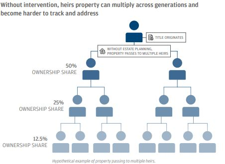

<!DOCTYPE html>
<html>
<head>
	<meta charset="utf-8">
	<meta name="viewport" content="width=device-width, initial-scale=1">
	<meta name="keywords" content="Kayla Lumpkin/>
	<meta http-equiv="X-UA-Compatible" content="IE=edge">
	<title>Kayla Lumpkin</title>

	<!-- Fonts -->
	<link rel="stylesheet" href="https://use.typekit.net/cba1top.css">

	<!-- Latest compiled and minified CSS -->
	<link rel="stylesheet" href="https://maxcdn.bootstrapcdn.com/bootstrap/3.3.7/css/bootstrap.min.css">

	<!-- jQuery library -->
	

	<!-- Latest compiled JavaScript -->
	

	<!-- MAIN CSS -->
	<link rel="stylesheet" href="css/style.css">

	<!-- MAIN JS -->
	

	<!-- MAIN JQUERY -->
	

</head>
<body>

	<!-- NAVBAR -->
	<section class="container-fluid mainHeader fadeIn" id="navbar">
		

		  

		    

		      <button type="button" class="navbar-toggle" data-toggle="collapse" data-target=".navbar-collapse">
		        
		        
		        
		      </button>
		      <a class="navbar-brand" href="#">Kayla Lumpkin</a>
		    

		    

		      <ul class="nav navbar-nav">
		        <li class="inactive" data-toggle="collapse" data-target=".navbar-collapse.in"><a href="#">About</a></li>
		        <li><a href="#projects" data-toggle="collapse" data-target=".navbar-collapse.in">Projects</a></li>
		      </ul>
		    
<!--/.nav-collapse -->
		  

		

	</section>

		<!-- ABOUT ME -->

		<section class="container-fluid about fadeIn" id="about">
			<h3>Kayla Lumpkin</h3>
			

			  

			   

				  
			   

			   

				  

					  

					  

						

						  <h4 class="panel-title">
							<a data-toggle="collapse" data-parent="#accordion" href="#collapse1">
							About Me</a>
						  </h4>
						

						

						  
Hello World! I'm an experienced professional with expertise in transforming data into actionable insights. With a focus on housing policy and planning, I've helped federal and local agencies, non-profits, and government relations teams advance housing market equity. I excel in project management, writing clear and concise materials, data visualization (Power BI, ArcGIS, R Studio), and data analysis (R Studio, Excel). I'm passionate about collaborating with diverse stakeholders to implement solutions to help ameliorate systemic challenges and empower historically marginalized communities. 
							  Let's connect to discuss how I can support your organization.
						  

						

					  

					  

						

						  <h4 class="panel-title">
							<a data-toggle="collapse" data-parent="#accordion" href="#collapse2">
							Contact</a>
						  </h4>
						

						

						  
<a href="https://www.linkedin.com/in/kaylamlumpkin" target="_blank">Linkedin</a> 
							<a href="mailto: k.m.lumpkin@outlook.com">Email</a> 
						  

						

					  

					  

						

						  <h4 class="panel-title">
							<a data-toggle="collapse" data-parent="#accordion" href="#collapse3">
							Resume</a>
						  </h4>
						

						

						  
<a href="pdfs/lumpkin_resume.pdf" target="_blank">Resume</a>  
							<!--Writing Samples:  
						<a href="pdfs/MUSA508_HW5_KristinChang.pdf">DRAFT Policy Memo: Recidivism Algorithm for Statewide Prison to Employment Initiative</a> 
						<a href="pdfs/CCTermPaper1.pdf">CASE STUDY: Vineyard Wind 1, the First U.S. Large-Scale Offshore Wind Project</a>-->
					

						

					  

					

				  

			   

			 

			

		</section>

	<section class="container-fluid projects fadeIn" id="projects">
			<!-- 

		  	
 --><h3>Work Product</h3> 
			<h2>Writing Samples</h2> 
			

					

					  

					  	

						    

<a href="pdfs/affh_ej.pdf" target="_blank">Affirmatively Furthering Fair Housing and Environmental Justice</a>

							
							
<h4>The Policy and Legislative Initiatives Division drafted a series of white papers to inform senior leaders of the fair housing nexus to topics ranging from food access, land use and zoning, to source of income protections. This white paper offers recommendations on how the Office of Fair Housing and Equal Opportunity can incorporate environmental justice considerations in the enforcement of the Affirmatively Furthering Fair Housing (AFFH) Rule. I wrote the Executive Summary, Introduction, Environmental Hazards, Climate Change Disparities to Consider in Fair Housing Analyses, and Best Practices sections, while a colleague wrote the Legal Framework section. </h4>
  
			  			

					  

					  

						

						  

<a href="pdfs/generational-wealth-heirs-property-policy-factsheet.pdf" target="_blank">Preserving Generational Wealth for Heirs Property Homeowners</a>

						  
						  
<h4>This policy brief examines challenges that arise when homeowners die without wills, creating a fractional ownership state known as "heirs property" which disproportionately affects Black, Latino, Hispanic, and low-income communities. While at the PolicyCenter, I wrote this brief to inform  policymakers, nonprofits, and financial institutions and recommend comprehensive solutions for affected households. This unstable form of homeownership threatens stability and wealth-building for households across the U.S., impacting an estimated 440,000 parcels valued at $41 billion. My recommendations to address the issue include targeted prevention policies and resolution mechanisms to preserve generational wealth.</h4>
  
						

					  

					  

					  	 

						    

<a href="pdfs/land_use.pdf" target="_blank">Land Use Regulation in the City of Philadelphia</a>

						  
						  
<h4>This paper, written for a University of Pennsylvania Land Use Law course, analyzes Philadelphia's zoning appeal process through two contrasting ZBA case studies. I examine how the city's Zoning Board of Adjustment navigates community input when considering variances, revealing tensions between theory and practice in urban land regulation. My analysis shows that appointed ZBA members often favor development interests over community and planning commission recommendations, with limited transparency in their decision-making. The paper demonstrates how procedural limitations in Philadelphia's land use system can perpetuate inequalities, particularly in historically marginalized neighborhoods like Tioga and Point Breeze, raising important questions about the democratic principles underlying municipal zoning practices.</h4>
  
					   

					

				

			
   
			<h2>Data Viz and Tools</h2> 
			

				

				  

					  

						

<a href="https://data.huduser.gov/dashboard/" target="_blank">Socio-Demographic Data Dashboards</a>

						
						
<h4>The beta version of the Socio-Demographic Data Dashboards was created to visualize local demographic, environmental, and housing conditions for select Fiscal Year 2023 Department of Housing and Urban Development (HUD) Jurisdictions. The dashboards feature interactive maps, text, tables, and charts created with data from the 2017-2021 5-Year American Community Survey, the Department of Transportation, the Environmental Protection Agency, and internal HUD administrative data. The tool is expected to serve as a resource for local governments, Public Housing Agencies, states, and community organizations to assess housing needs, prepare HUD mandated reports, and advance local housing and community development initiatives. This Beta Version represents the initial implementation phase, with ongoing refinements based on user feedback to enhance functionality and data visualization capabilities before the full public release.</h4>
  
					  

				  

				  

					   

						

<a href="https://arcg.is/b4bLm" target="_blank">Site Suitability: Siting Climate Resilient Housing in the U.S. Virgin Islands</a>

						
						
<h4>This site suitability analysis was conducted with ArcGIS Pro to identify optimal locations for new housing development on the island of St. Thomas in the US Virgin Islands. The analysis incorporates multiple factors including vacant land availability, transportation routes, proximity to amenities, environmental considerations, and topographical constraints specific to island geography. Using weighted overlay techniques, I identified an area suitable for housing development based on the aforementioned physical feasibility and social factors. The results offer actionable insights for planners and developers to target investments that maximize development potential and community benefit while respecting St. Thomas's limited land resources and environmental conditions. The site suitability analysis was completed for the 2nd year City Planning Studio's St. Thomas Resilience Plan, which addressed the island’s vulnerability to climate change and sea level rise. </h4>
  
					  

				  

				  

						  

							
Technical Assistance Funding Dashboard</a>

							
							
<h4>A custom data dashboard created for senior leadership in the Office of Fair Housing and Equal Opportunity (FHEO) to visualize and monitor the status of technical assistance (TA) funds. I created this dashboard using Power Automate and Power BI to provide at-a-glance understanding of fund allocation, and most critically, quick identification of trends, bottlenecks, and opportunities for strategic resource management, helping leadership make data-driven decisions about technical assistance priorities and interventions.</h4>
  
						 

				  

				

	</section>

</body>
</html>